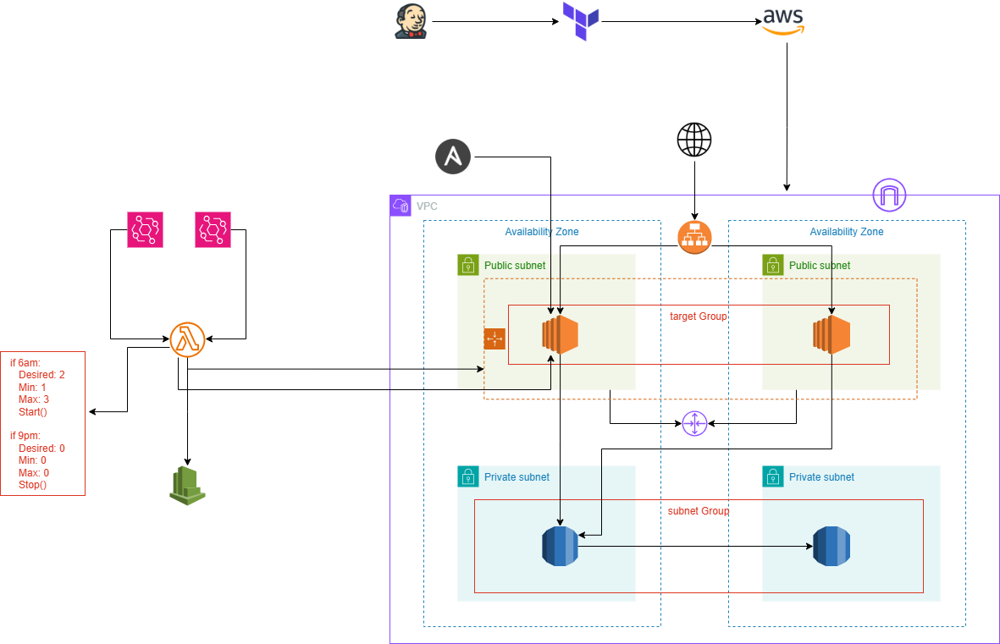

**Project Title:** Automated Cloud Infrastructure with Terraform.

**Technologies Used**: Terraform, Jenkins, Lambda, CloudWatch, EventBridge, Ansible

**Links**: [GitHub](https://github.com/sriram-ravi705/2-tier-app-deployment.git)

**Objective**:

* **Provisioned Infrastructure with Terraform**: Created and managed resources like VPC, subnets, internet gateway, route tables, EC2 instances, RDS MySQL, load balancers, auto-scaling groups, target groups, and security groups on AWS.
    
* **Implemented CI/CD Pipeline with Jenkins**: Built a fully automated Jenkins pipeline for continuous integration and deployment of infrastructure on AWS.
    
* **Automated EC2 Instance Management**: Configured CloudWatch, EventBridge, and Lambda to automatically stop and start EC2 instances using cron expressions for cost optimization and resource management.
    
* **Ansible Installation and Remote Exec Provisioner on EC2 Instances**: Installed Ansible on EC2 instances and used the **remote-exec** provisioner in Terraform to execute Ansible commands remotely for automation of software installation, configuration management, and environment setup.
    

**Architecture**:

